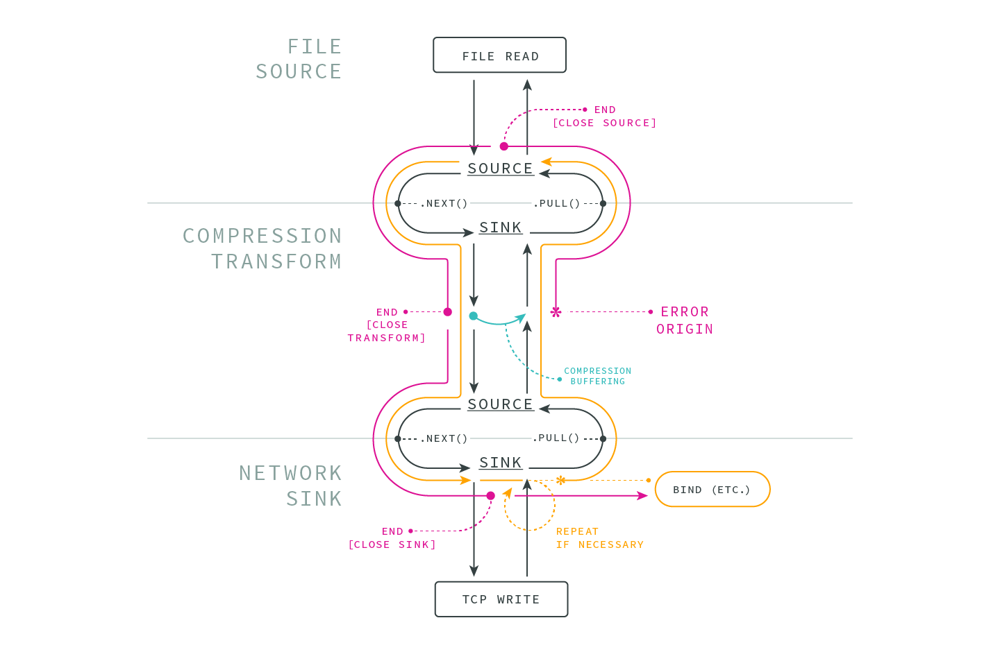

# BOB

A binary data "streams+" API & implementations via data producers, data consumers, and pull flow.

_The name? B~~L~~OB — Matteo Collina._

_Bytes Over Buffers — Thomas Watson_

This is [a Node.js strategic initiative](https://github.com/nodejs/TSC/blob/master/Strategic-Initiatives.md#current-initiatives) aiming to improve Node.js streaming data interfaces, both within Node.js core internally, and hopefully also as future public APIs.



## Published Modules

The following modules contain usable components (sources, sinks, or transforms) and are published to npm.
- The status codes enum: [bob-status](https://github.com/Fishrock123/bob-status) _([npm](https://www.npmjs.com/package/bob-status))_
- A file system source: [fs-source](https://github.com/Fishrock123/fs-source) _([npm](https://www.npmjs.com/package/fs-source))_
- A file system sink: [fs-sink](https://github.com/Fishrock123/fs-sink) _([npm](https://www.npmjs.com/package/fs-sink))_
- A zlib transform: [zlib-transform](https://github.com/Fishrock123/zlib-transform) _([npm](https://www.npmjs.com/package/zlib-transform))_
- A crc32 transform: [crc-transform](https://github.com/Fishrock123/crc-transform) _([npm](https://www.npmjs.com/package/crc-transform))_
- Header for the C++ api: [bob-base](https://github.com/Fishrock123/bob-base) _([npm](https://www.npmjs.com/package/bob-base))_

The following modules are not published but are 'functional'.
- A TCP socket "duplex": [in "socket"](https://github.com/Fishrock123/socket)
- A TCP server of "duplex" sockets: [also in "socket"](https://github.com/Fishrock123/socket)

## API Reference

The following files serve as the API's reference:
- The [Status Enum](reference-status-enum.js) - _Status codes_
- A [Source](reference-source.js) - _The data provider_
- A [Sink](reference-sink.js) - _The data consumer_
- A [Passthrough](reference-passthrough.js) - _A good example of the whole API_
- A [Verify Passthrough](reference-verify.js) - _A typechecking API enforcement passthrough_
- A [Buffered Transform](reference-buffered-transform.js) - _An example of buffering_
- [`bob.h`](https://github.com/Fishrock123/bob-base/blob/master/bob.h) - _The C++ header in 'bob-base'_

### Examples

The composition of the classes looks like this:
```js
const { Stream } = require('bob-streams')

const source = new Source(/* args */)
const xform = new Transform(/* args */)
const sink = new Sink(/* args */)

const stream = new Stream(source, xform, sink)
stream.start(error => {
  // The stream is finished when this is called.
})
```

An entire passthrough could look like this:
```js
class PassThrough {
  bindSource (source) {
    source.bindSink(this)
    this.source = source
    return this
  }

  bindSink (sink) {
    this.sink = sink
  }

  next (status, error, buffer, bytes) {
    this.sink.next(status, error, buffer, bytes)
  }

  pull (error, buffer) {
    this.source.pull(error, buffer)
  }
}
```

## API Extension Reference

The following files serve as API extension references:
- [extension-stop](reference-extension-stop.js) - Tell a source to stop.
  * Useful for dealing with timeouts on network APIs.

## Project Approach

High-level timeline:
- Prototype separate from core entirely.
- Move into nodejs org once JS & C++ APIs are significantly prototyped.
- Begin transitioning Node.js internals once the APIs and perf are proved.
- If an internal transition works out well, begin planning public APIs.

All of these steps necessitate the buy-in of many stakeholders, both in Node.js core and the greater Node.js ecosystem. This is a long-term project by necessity and design.

## Goals
Some collective goals for this initiative.

- Both performance and ease-of-use are key.
- Implementable in a performant and usable way for both JS and C++.
- Browser portability is preferable.

### Protocol
_As a preface, "protocol" refers to a system with "producer / source" and "consumer / sink" endpoints._

The Protocol itself must be simple:
- Pull-based: The consumer requests ("pulls") data from the producer.
- Binary-only: Data is binary buffers only, "object mode" and string encodings are not supported at the protocol level.
- Stateless: The protocol must not require state to be maintained out-of-band.
  - _Non-normative: While the protocol itself does not require out-of-band state, actual operations almost always do._
  - Minimize state assumed between calls.
- One-to-one: The protocol assumes a one-to-one relationship between producer and consumer.
- Timing agnostic: The protocol makes no timing (sync or async) assumptions.
- No buffering: The protocol must not require buffering (although specific implementations might).
  - _Non-normative: While the protocol itself does not require buffering, starting sources almost always do (including transforms)._
- In-line errors and EOF: Errors, data, and EOF ("end") should flow through the same call path.

### Consumer
- Should make no assumption on the timing of when data will be received (sync or async).
- Should own any preallocated memory (the buffer).
- Must never make more than one data request upstream at the same time.

## Performance

Please see [performance.md](performance.md) for profiling results & information.

Current results estimate a 30% decrease of CPU time in bad cases, and up to 8x decrease in good cases. This should correlate to overall throughput but may not be exact.

## Project Layout

API reference examples sit in the top-level directory and are prefixed by `reference-`.
These are functional and tested when practical, notably `reference-verify`, `reference-passthrough`, and `verify-buffered-transform`.

Other helpers, such as `Stream()`, reside in the `/helpers/` and `/tests/helpers` directories.
All useful and usable components in this repo are exported from `index.js` with the `bob-streams` npm module.

Functional sources, sinks, and so on can be found in their own npm modules. See [Published Modules](#Published Modules).

### Development

#### Tests

`npm install && npm test`

#### Building the addons

The addons are presently very out-of-date.

You must have a local install of Node master @ ~ 694ac6de5ba2591c8d3d56017b2423bd3e39f769

```
npm i node-gyp
node-gyp rebuild --nodedir=your/local/node/dir -C ./addons/passthrough
node-gyp rebuild --nodedir=your/local/node/dir -C ./addons/fs-sink
node-gyp rebuild --nodedir=your/local/node/dir -C ./addons/fs-source
```

## License

[MIT Licensed](license) — _[Contributions via DCO 1.1](contributing.md#developers-certificate-of-origin)_
